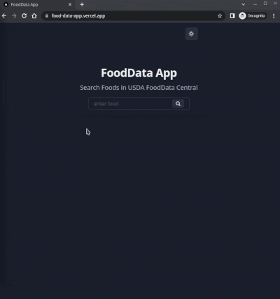

[![LinkedIn][linkedin-shield]](https://www.linkedin.com/in/utoker/)

<!-- PROJECT LOGO -->
 

  

<h3 align="center">FoodData App</h3>
     
    <a href="https://github.com/utoker/FoodData-App/tree/main/src"><strong>Explore the docs »</strong></a>
     
     
    <a href="https://www.reqq.cc/">View Website</a>

## About The Project

FoodData App is a web app for getting nutrient profile data of requested food from the United States Department of Agriculture's Food Database with Rest API.

<ul>
  <li>Sourced data from the USDA via REST API by implementing Axios.</li>
  <li>Enabled server-side rendering by utilizing Next.js.</li>
    <li>Designed React components by implementing Chakra UI.</li>
    <li>Maintained up-to-date knowledge of current and emerging technologies, products, and trends related to the project.</li>
</ul>

## Usage

Use the text input bar to enter the food you want to get nutrient profile.

(<a href="#top">back to top</a>)

## Built With

- [Next.js](https://nextjs.org/) - A React framework with hybrid static & server rendering
- [React.js](https://reactjs.org/) - A JavaScript library for building user interfaces.
- [Chakra UI](https://chakra-ui.com/) - A simple, modular and accessible component library for React
- [Axios](https://axios-http.com/) - Promise based HTTP client for the browser and node.js

## Contact

Umut Toker - utoker@gmail.com

LinkedIn: [https://www.linkedin.com/in/utoker/](https://www.linkedin.com/in/utoker/)

(<a href="#top">back to top</a>)

[linkedin-shield]: https://img.shields.io/badge/-LinkedIn-black.svg?style=for-the-badge&logo=linkedin&colorB=555
